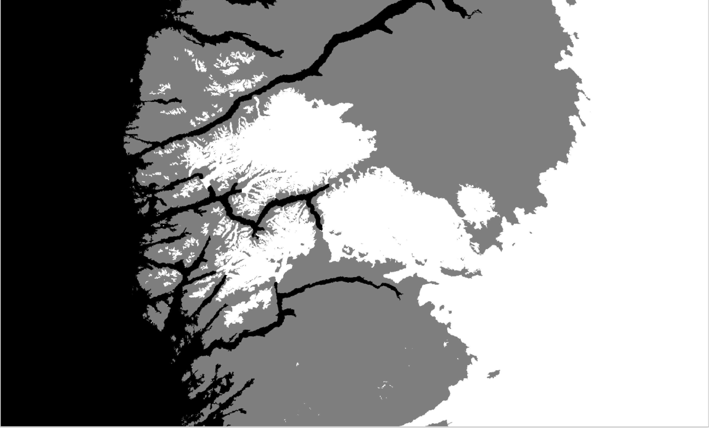
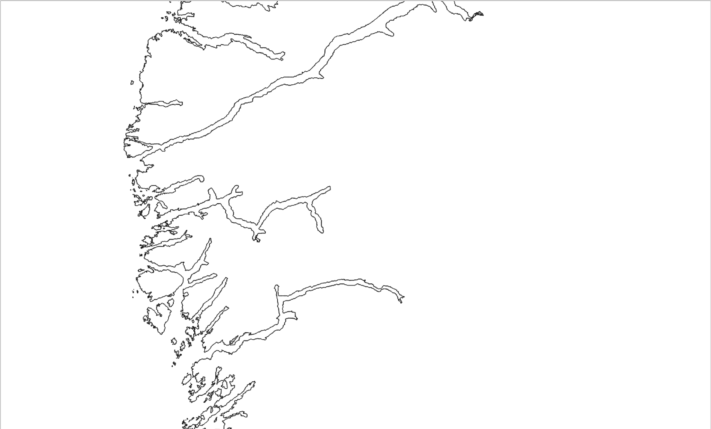

# Create a polygon mask

Takes in a raster dataset, changes the values to make it binary (i.e. 1/0) and then out pops a shapefile which adopts the values of the input raster.

So if we have a raster with some values (say 0, 1 and 2 perhaps representing iocean, land and ice) like this:

We can reclassify the raster to 2 values (e.g. 0 and 1 perhaps representing ocean and everything else) and then convert the raster to a vector getting this:

The mask passed in is a transformed version of the GIMP DEM as modified following [Morlighem et al. 2014](http://www.nature.com/ngeo/journal/v7/n6/full/ngeo2167.html). A 5km post version of the mask is available in ./raster and the R code is set up to use this (i.e. the paths are hardwired). 

For immediate use, a 100m resolution vector outline is available in ./shp

However, the code framework should work for any mask, just change the path and the values which you need to alter to make it 1/0.

The code is taken largely from this post: [https://johnbaumgartner.wordpress.com/2012/07/26/getting-rasters-into-shape-from-r/](https://johnbaumgartner.wordpress.com/2012/07/26/getting-rasters-into-shape-from-r/)

If running on windows, try using the polygonizer function as opposed to gdal_polygonizeR.

Also, this will only work if you have [gdal](http://www.gdal.org/) downloaded locally!
